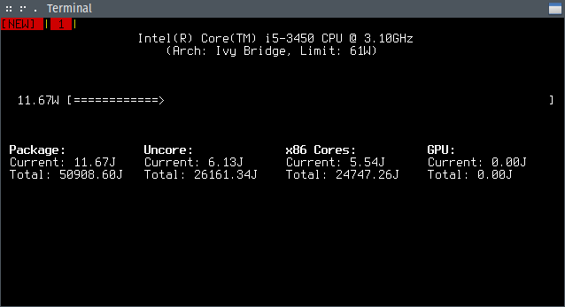

Powermon
========

Powermon is a small utility that reads the CPU internal power counters,
calculates the current power consumption and displays it together with
some nice statistics on an interactive curses interface. At this time
Powermon is exclusive for the FreeBSD operating system, it's based upon
FreeBSDs cpuctl(4) interface.

Supported CPUs
--------------
All Intel CPUs starting with Sandy Bridge are supported. Older Intel
CPUs and CPUs from other vendors don't expose the necessary performance
counters. Additionally some server CPUs like those based on Haswell and
Broadwell do not provide the necessary data.

Powermon needs to know some informations about the CPU. Some of these
informations are determined from the CPUID and several MSRs, others are
read from internal tables. If a CPU is unknown to Powermon it may not
work, therefor the necessary informations can be given at command line.

How it works
------------
All Intel CPUs since Sandy Bridge feature a co-processor for power
management called Power Management Unit (PMU). The PMU has an accurate
view over the current power consumption. Some data about the current
power consumption is written into MSRs. Powertop reads this MSRs,
applies some correction values and calculates the power consumption
in joule.

Additionally the PMU gives the abbility to set power limits, e.g. to
tell the CPU or one component (x86 cores, GPU, etc.) not not comsume
more power than the given value. This is currently not implemented by
Powermon.

More informations can be found here: [Intel® Power
Governor](https://software.intel.com/en-us/articles/intel-power-governor
"Intel Power Govenor")

